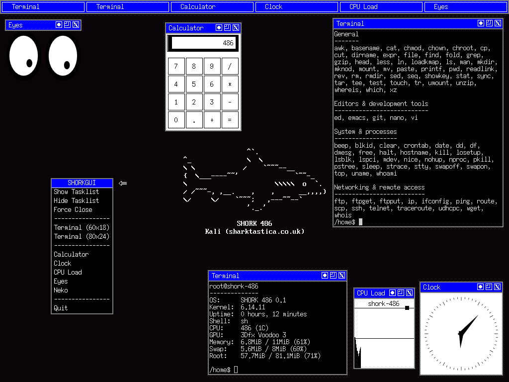

# SHORK 486 Gallery

* Updated 11th April 2026

## Photos

<table style="table-layout: fixed; width: 100%;">
  <tr>
    <td style="width: 33%; text-align: center;"></td>
    <td style="width: 33%; text-align: center;"></td>
  </tr>
  <tr>
    <td>First boot on IBM ThinkPad 365ED</td>
    <td>shorkfetch on IBM ThinkPad 365ED</td>
  </tr>
</table>

## 86Box screenshots

<table style="table-layout: fixed; width: 100%;">
  <tr>
    <td style="width: 33%; text-align: center;"></td>
    <td style="width: 33%; text-align: center;"></td>
  </tr>
  <tr>
    <td>Boot menu</td>
    <td>First boot</td>
  </tr>
</table>

<table style="table-layout: fixed; width: 100%;">
  <tr>
    <td style="width: 50%; text-align: center;"></td>
    <td style="width: 50%; text-align: center;"></td>
  </tr>
  <tr>
    <td>shorkfetch</td>
    <td>shorkhelp (--commands)</td>
  </tr>
</table>

<table style="table-layout: fixed; width: 100%;">
  <tr>
    <td style="width: 50%; text-align: center;"></td>
    <td style="width: 50%; text-align: center;"></td>
  </tr>
  <tr>
    <td>shorkdir</td>
    <td>shorksay</td>
  </tr>
</table>

<table style="table-layout: fixed; width: 100%;">
  <tr>
    <td style="width: 50%; text-align: center;"></td>
    <td style="width: 50%; text-align: center;"></td>
  </tr>
  <tr>
    <td>shorkfont (1)</td>
    <td>shorkfont (2)</td>
  </tr>
</table>

<table style="table-layout: fixed; width: 100%;">
  <tr>
    <td style="width: 50%; text-align: center;"></td>
    <td style="width: 50%; text-align: center;"></td>
  </tr>
  <tr>
    <td>shorkmap</td>
    <td>shorkoff</td>
  </tr>
</table>

<table style="table-layout: fixed; width: 100%;">
  <tr>
    <td style="width: 50%; text-align: center;"></td>
    <td style="width: 50%; text-align: center;"></td>
  </tr>
  <tr>
    <td>ed</td>
    <td>nano</td>
  </tr>
</table>

<table style="table-layout: fixed; width: 100%;">
  <tr>
    <td style="width: 50%; text-align: center;"></td>
    <td style="width: 50%; text-align: center;"></td>
  </tr>
  <tr>
    <td>Mg</td>
    <td>git init</td>
  </tr>
</table>

<table style="table-layout: fixed; width: 100%;">
  <tr>
    <td style="width: 50%; text-align: center;"></td>
    <td style="width: 50%; text-align: center;"></td>
  </tr>
  <tr>
    <td>SVGA mode</td>
    <td>XGA mode</td>
  </tr>
</table>

<table style="table-layout: fixed; width: 100%;">
  <tr>
    <td style="width: 50%; text-align: center;"></td>
    <td style="width: 50%; text-align: center;"></td>
  </tr>
  <tr>
    <td>SHORKGUI (experimental)</td>
    <td></td>
  </tr>
</table>

## VMware Workstation screenshots

<table style="table-layout: fixed; width: 100%;">
  <tr>
    <td style="width: 50%; text-align: center;"></td>
    <td style="width: 50%; text-align: center;"></td>
  </tr>
  <tr>
    <td>FTP</td>
    <td>Git clone</td>
  </tr>
</table>
